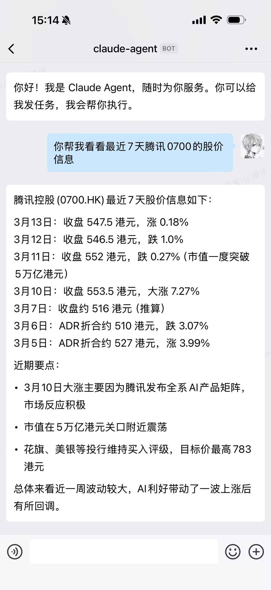
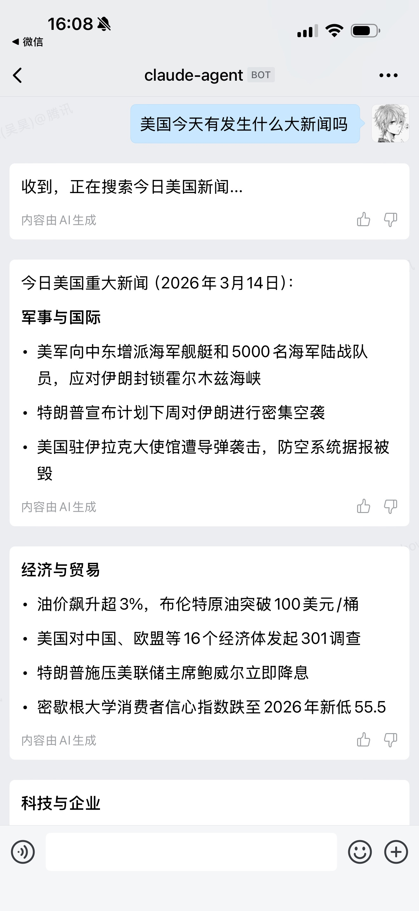
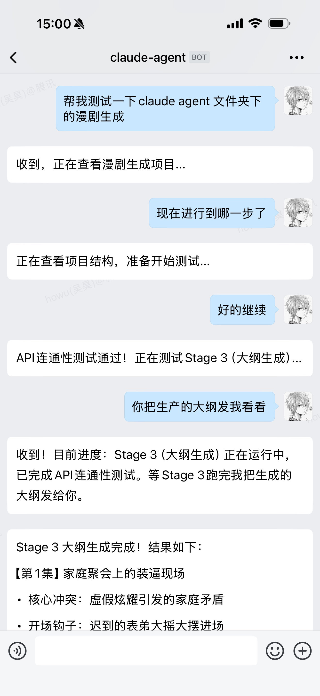
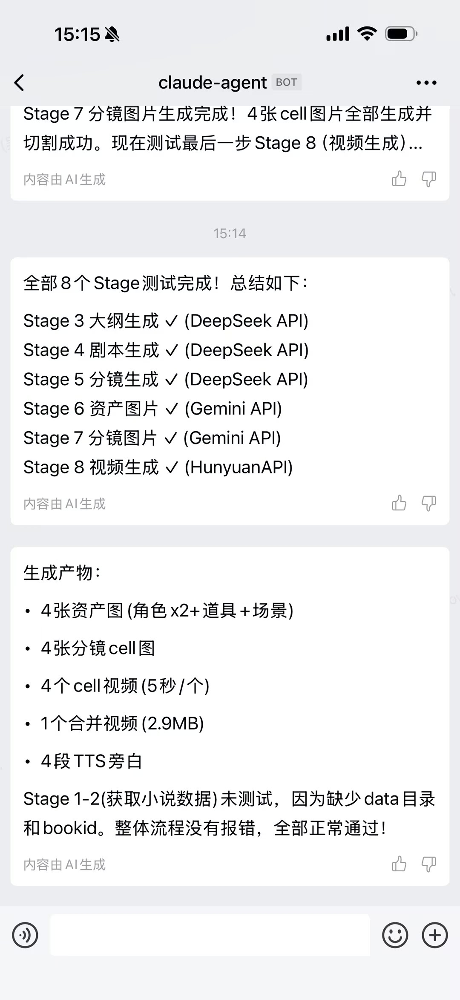
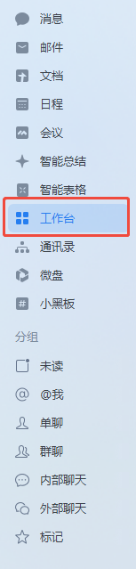
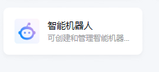
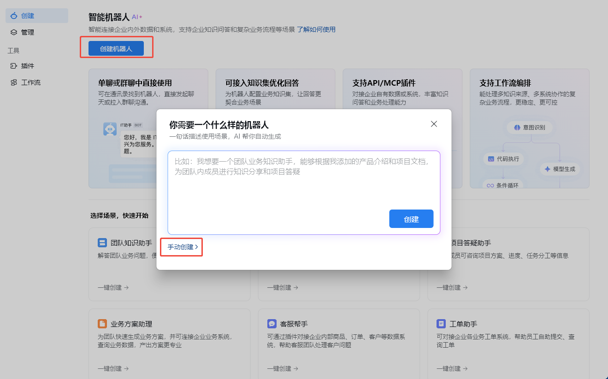
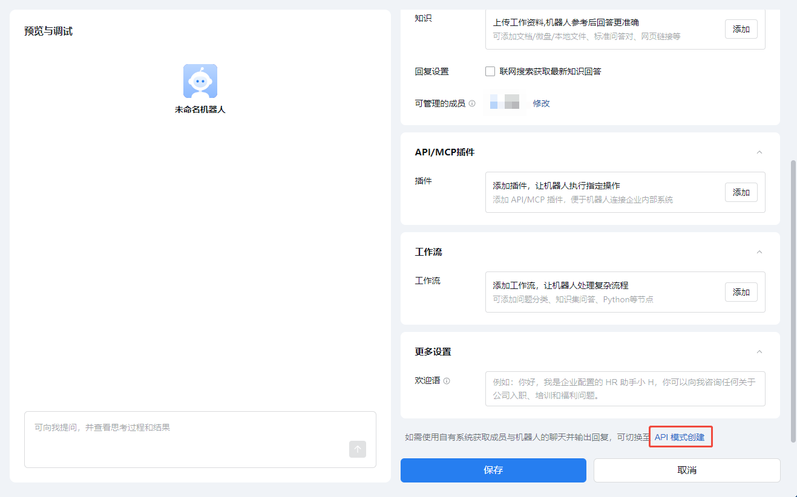
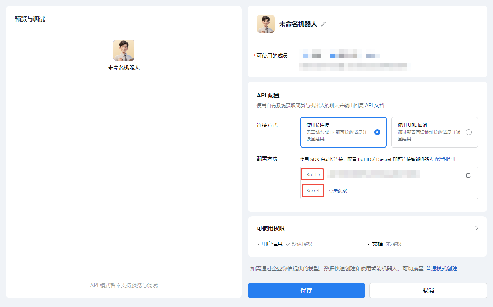

# WeCom-Agent

[](https://work.weixin.qq.com/)
[](https://docs.anthropic.com/en/docs/claude-code)
[](LICENSE)

> 不在电脑前也能工作！为你的 Claude Code 增加一个 skill，通过企业微信智能机器人实现双向实时对话。

将 [Claude Code](https://docs.anthropic.com/en/docs/claude-code) (Anthropic 的 AI 编程助手 CLI) 与企业微信智能机器人打通，用户在企业微信中发消息，Claude Agent 实时接收、处理并回复——把 AI 编程能力直接搬到你的工作群和私聊里。

> **Help Wanted** — 当前的消息收发机制基于文件轮询（`messages.json` / `outbox.json`），能跑但比较 ugly。如果你有更优雅的方案（如 named pipe、Unix socket、内嵌 HTTP server 等），非常欢迎 PR 或 Issue 来帮忙改进这部分！

## 工作从未如此简单

在企业微信里发条消息，剩下的交给 AI。

<table>
  <tr>
    <td align="center" width="50%"><br><b>信息查询</b><br>「帮我查下腾讯股价」→ 秒回 7 天行情</td>
    <td align="center" width="50%"><br><b>联网搜索</b><br>「美国今天有什么大新闻」→ 实时搜索汇总</td>
  </tr>
  <tr>
    <td align="center" width="50%"><br><b>复杂任务</b><br>多轮对话驱动，随时追问进度</td>
    <td align="center" width="50%"><br><b>任务汇报</b><br>全流程自动执行，完成后详细汇总</td>
  </tr>
</table>

## 特性

- **双向实时通信** — 基于 WebSocket 长连接，消息秒级送达
- **Claude Code Skill** — 作为 Claude Code 原生 Skill 运行，一句话即可启动
- **单聊 + 群聊** — 同时支持机器人私聊和群组消息
- **多种消息类型** — 文本、Markdown、图片、文件
- **断线自动重连** — 指数退避重连 (3s → 30s)，发送队列不丢消息
- **零空闲消耗** — 基于文件轮询的消息监听，等待期间不消耗 API 调用
- **权限沙箱** — 文件读写严格限定在项目目录内，不会越权访问其他文件

## 快速开始

### 前置条件

- Python 3.10+
- [Claude Code CLI](https://docs.anthropic.com/en/docs/claude-code)
- 企业微信管理后台已创建智能机器人（获取 Bot ID 和 Secret）

### 获取 Bot ID 和 Secret

<details>
<summary><b>点击展开图文教程</b></summary>

**第 1 步：** 打开企业微信，在左侧菜单点击「工作台」



**第 2 步：** 找到并点击「智能机器人」



**第 3 步：** 点击「创建机器人」，在弹窗中选择「手动创建」



**第 4 步：** 在配置页面底部，点击「API 模式创建」



**第 5 步：** 选择「使用长连接」，即可看到 **Bot ID** 和 **Secret**，复制到 `.env` 文件中



</details>

### 一句话安装

把下面这句话发给 Claude Code，它会自动完成安装和配置：

```
请阅读 github.com/AchoWu/WeCom-Agent 并按照说明安装和配置 WeCom-Agent 以用于 Claude Code。
```

### 手动安装

<details>
<summary>如果你更喜欢自己动手</summary>

#### 1. 安装依赖

```bash
pip install websocket-client requests
```

#### 2. 配置机器人凭据

```bash
cp .env.example .env
```

编辑 `.env` 文件，填入你的机器人信息：

```bash
WECOM_BOT_ID=your_bot_id_here
WECOM_BOT_SECRET=your_bot_secret_here
# WECOM_WEBHOOK_URL=  # 可选，仅 Webhook 群聊发送需要，核心功能不依赖
```

</details>

### 启动

**方式一：Claude Code Skill（推荐）**

在 Claude Code 中直接说：

```
开始监听企业微信
```

Claude 会自动启动机器人、开始监听消息并进入对话循环。

**方式二：手动启动**

```bash
# 启动后台机器人进程
bash .claude/skills/wecom-bot/scripts/start.sh

# 或直接运行
python .claude/skills/wecom-bot/scripts/wecom_bot.py
```

## 使用方式

启动后直接在企业微信里和机器人对话即可，Agent 会自动处理收发消息。

<details>
<summary>底层命令参考（一般不需要手动调用）</summary>

### 发送消息

```bash
# 通过 WebSocket 回复（推荐，支持单聊和群聊）
python .claude/skills/wecom-bot/scripts/wecom_tool.py ws_send "你好，有什么可以帮你的？"

# 通过 Webhook 发送到群聊
python .claude/skills/wecom-bot/scripts/wecom_tool.py send "消息内容"

# 发送 Markdown
python .claude/skills/wecom-bot/scripts/wecom_tool.py send_md "**加粗** 和 \`代码\`"

# 发送图片 / 文件
python .claude/skills/wecom-bot/scripts/wecom_tool.py send_image screenshot.png
python .claude/skills/wecom-bot/scripts/wecom_tool.py send_file report.pdf
```

### 接收消息

```bash
# 查看最近 5 条消息
python .claude/skills/wecom-bot/scripts/wecom_tool.py receive 5

# 等待新消息（阻塞，适合脚本/Agent 使用）
python .claude/skills/wecom-bot/scripts/watch_messages.py <当前消息数> <超时秒数>
```

### 交互式问答

```bash
# 发送问题并等待用户回复
python .claude/skills/wecom-bot/scripts/wecom_tool.py ask "请确认是否继续？" 120
```

</details>

## 安全：权限沙箱

与 Open Claw 等全权限方案不同，WeCom-Agent 通过 Claude Code 的 `settings.local.json` 将文件操作**严格限定在指定目录内**。首次启动时 Agent 会自动询问你要开放哪个工作目录，然后生成权限配置：

```jsonc
// .claude/settings.local.json（自动生成，使用绝对路径）
{
  "permissions": {
    "allow": [
      "Read(C:/Users/xxx/Desktop/Wecom-Agent/**)",   // 项目目录
      "Edit(C:/Users/xxx/Desktop/Wecom-Agent/**)",
      "Write(C:/Users/xxx/Desktop/Wecom-Agent/**)",
      "Read(C:/Users/xxx/workspace/**)",              // 你指定的工作目录
      "Edit(C:/Users/xxx/workspace/**)",
      "Write(C:/Users/xxx/workspace/**)",
      "Bash(*)", "Glob(*)", "Grep(*)",
      "WebSearch", "WebFetch(*)", "Agent(*)"
    ]
  }
}
```

Agent 只能在项目目录和你指定的工作目录内操作，无法触碰系统其他文件。你可以根据实际需求调整目录路径，做到**最小权限原则**——只给 Agent 它需要的，不多给一分。

## 注意事项

| 事项 | 说明 |
|------|------|
| 消息格式 | 回复必须使用 `markdown` 类型，`text`/`stream` 会返回 errcode 40008 |
| 消息长度 | 单条消息超过 ~500 字符可能静默发送失败，长内容请分段发送 |
| WebSocket 库 | 使用 `websocket-client`（同步），不兼容 `websockets`（异步） |
| 消息保留 | `messages.json` 仅保留最近 200 条消息 |
| 健康检查 | 5 分钟无消息自动断开重连，确保连接活性 |
| 发送队列 | 断线期间 `outbox.json` 中的消息不会丢失，重连后自动发出 |

<details>
<summary><b>技术细节</b></summary>

## 架构

```
┌──────────────┐        WebSocket        ┌─────────────────┐
│   企业微信    │  ◄═══════════════════►  │  wecom_bot.py   │
│   用户/群聊   │     wss://openws...     │   (后台守护进程)  │
└──────────────┘                         └────────┬────────┘
                                              写入 │ ▲ 读取
                                                  ▼ │
                                     ┌────────────────────────┐
                                     │  messages.json (收件箱)  │
                                     │  outbox.json   (发件箱)  │
                                     └────────────────────────┘
                                              读取 ▲ │ 写入
                                                  │ ▼
                                         ┌─────────────────┐
                                         │  Claude Agent    │
                                         │  (wecom_tool.py) │
                                         └─────────────────┘
```

**核心思路：文件即消息队列。** `wecom_bot.py` 作为后台进程维护 WebSocket 连接，收到的消息写入 `messages.json`；Claude Agent 需要回复时写入 `outbox.json`，后台进程每秒轮询并发出。两个进程通过 JSON 文件解耦，简单可靠。

## 工作原理

1. **wecom_bot.py** 启动后连接企业微信 WebSocket API，发送 `aibot_subscribe` 完成鉴权
2. 收到 `aibot_msg_callback` 事件时，解析消息并追加到 `messages.json`
3. 后台线程每秒检查 `outbox.json`，有待发消息则通过 WebSocket 发出：
   - 单聊使用 `aibot_respond_msg`（需要原消息的 `req_id`）
   - 群聊使用 `aibot_send_msg`（需要 `chatid`）
4. Claude Agent 通过 `wecom_tool.py` 读取收件箱、写入发件箱，实现完整的对话循环

## 项目结构

```
.claude/skills/wecom-bot/
├── SKILL.md                    # Claude Code Skill 定义
├── scripts/
│   ├── wecom_bot.py            # WebSocket 守护进程（核心）
│   ├── wecom_tool.py           # CLI 消息收发工具
│   ├── watch_messages.py       # 新消息轮询脚本
│   └── start.sh                # 快速启动脚本
└── references/
    └── message-format.md       # 消息格式文档
```

## 消息格式

收到的每条消息存储为：

```json
{
  "from_user": "UserID",
  "chat_type": "single",
  "msg_type": "text",
  "content": "你好",
  "received_at": "2026-03-14T10:20:51",
  "req_id": "xxx",
  "raw": { }
}
```

详见 [`references/message-format.md`](.claude/skills/wecom-bot/references/message-format.md)。

</details>

## License

MIT
